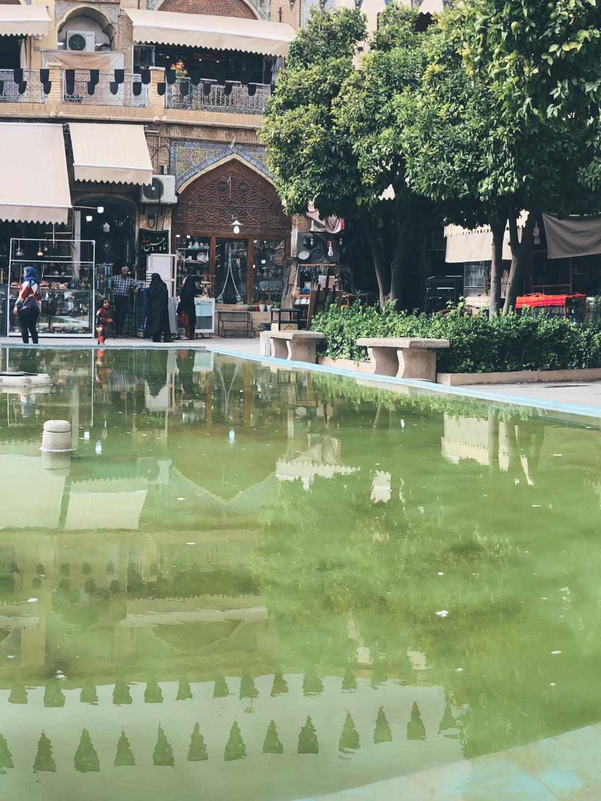

# Insta Pan

Simple python3 CLI application to split a panorama image into several images for uploading as a instagram collection.

## Setup

use pip on your virtualenv to install requirements:

```bash
  pip install -r requirements.txt
```

## Usage

```bash
  python insta_pan.py -i sample.jpg -r 3:4 -o
```

<details>
  <summary>this command will produce images below</summary>

### Original Image


### Generated Images




</details>

### options

```
-i: path to panorama image.
-d: output folder. default is {current working directory}/{image_name}
-r: splited images ratio {w:h}. default is 1:1
-o: optimize and resize images to a suitable size for uploading to instagram.
```
